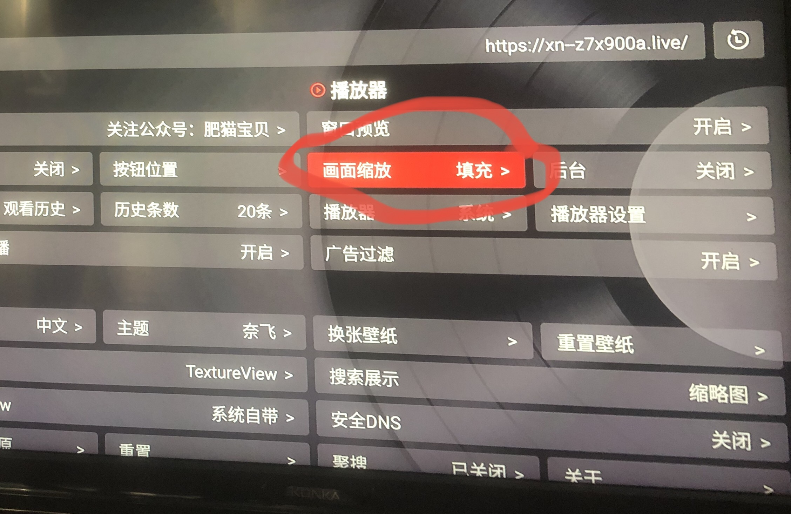

# ☁️☀️气象万千⛈️🌈天气预报❄️气象分析⚡️电视播放m3u列表
cctv 中央电视台 山东卫视 山东新闻 天气预报 气象分析 m3u文件生成

- [☁️☀️气象万千⛈️🌈天气预报❄️气象分析⚡️电视播放m3u列表](#️️气象万千️天气预报️气象分析️电视播放m3u列表)
  - [数据源](#数据源)
  - [生成和使用天气预报m3u文件](#生成和使用天气预报m3u文件)
    - [样例：](#样例)
    - [本地运行：](#本地运行)
    - [在线获取最新的m3u文件：](#在线获取最新的m3u文件)
    - [食用m3u文件：](#食用m3u文件)
    - [微信打赏🙏：](#微信打赏)
    - [有待完成](#有待完成)


## 数据源
1. https://www.weather.com.cn/video/ylist.shtml
2. [~~农业气象~~，需登录，放弃](https://m.weibo.cn/u/1969156553)
3. https://sdxw.iqilu.com/share/dHYtMjEtNTYyNjU0OQ.html#/
4. https://sdxw.iqilu.com/share/dHYtMjEtNTYyNTg5MQ.html#/

## 生成和使用天气预报m3u文件

### 样例：
[tq.m3u](tq.m3u)

### 本地运行：
```bash
node app.js > tq.m3u
```

### 在线获取最新的m3u文件：

[](https://github.com/AndrewGoal/cctv_weather_forecasting_m3u/actions/workflows/main.yml)

每半小时生成一次，最新版下载网址：

- https://github.com/AndrewGoal/cctv_weather_forecasting_m3u/releases/latest/download/cctv_weather_forecasting.m3u
- 墙内：https://github.moeyy.xyz/https://github.com/AndrewGoal/cctv_weather_forecasting_m3u/releases/latest/download/cctv_weather_forecasting.m3u

### 食用m3u文件：
- **在线演示：[iptvplayer.stream](https://iptvplayer.stream/import/DsfiTxgjLr)**
- Mac/iOS平台：[APTV](https://apps.apple.com/tw/app/aptv/id1630403500)
- VLC播放器：⌘ + n 以上m3u网址
- IINA播放器：⇧ + ⌘ + o 以上m3u网址
- 智能电视或电视盒子上利用[TVBoxOSC 20240819-1117版](https://github.com/o0HalfLife0o/TVBoxOSC/releases/tag/20240819-1117)，通过如图设置（并设置启动app直接进入直播），可作为专用的天气预报、气象分析电视app，效果如图：





### 微信打赏🙏：


### 有待完成
- ✅ 数据源1的农业气象视频不再更新，需要 ~~利用[爬虫](https://github.com/dataabc/weibo-crawler)，~~ 从数据源2——农业气象微博上获取，并生成到m3u文件中
- ✅ 数据源3、4
