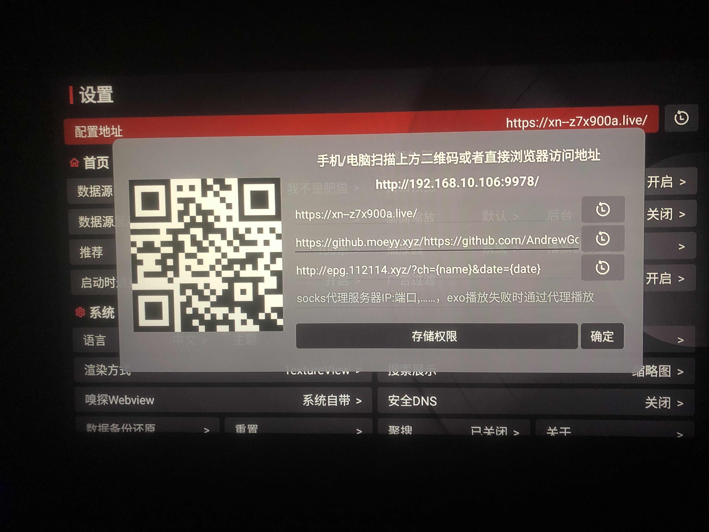
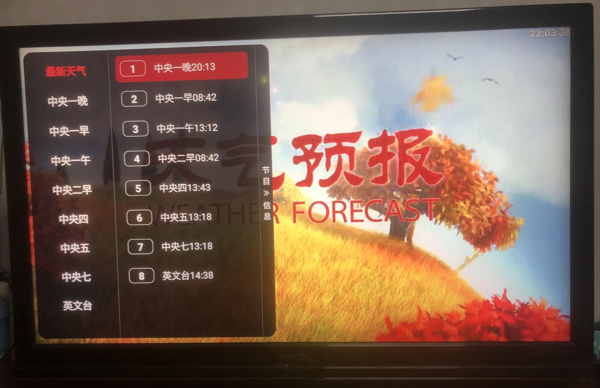

# cctv_weather_forecasting_m3u
cctv 中央电视台 天气预报 气象分析 m3u文件生成

## 数据源
- https://www.weather.com.cn/video/ylist.shtml

## 生成和使用天气预报m3u文件

### 样例：
[tq.m3u](tq.m3u)

### 本地运行：
```bash
node app.js > tq.m3u
```

### 在线获取最新的m3u文件：

[](https://github.com/AndrewGoal/cctv_weather_forecasting_m3u/actions/workflows/main.yml)

每半小时更新一次，最新版下载网址：

- https://github.com/AndrewGoal/cctv_weather_forecasting_m3u/releases/latest/download/cctv_weather_forecasting.m3u
- 墙内：https://github.moeyy.xyz/https://github.com/AndrewGoal/cctv_weather_forecasting_m3u/releases/latest/download/cctv_weather_forecasting.m3u

### 食用m3u文件：
- VLC播放器：⌘ + n 以上m3u网址
- IINA播放器：⇧ + ⌘ + o 以上m3u网址
- [TVBoxOSC 20240819-1117版](https://github.com/o0HalfLife0o/TVBoxOSC/releases/tag/20240819-1117)，可以此配置为专用的天气预报电视app，效果如同：




### 微信打赏🙏：

